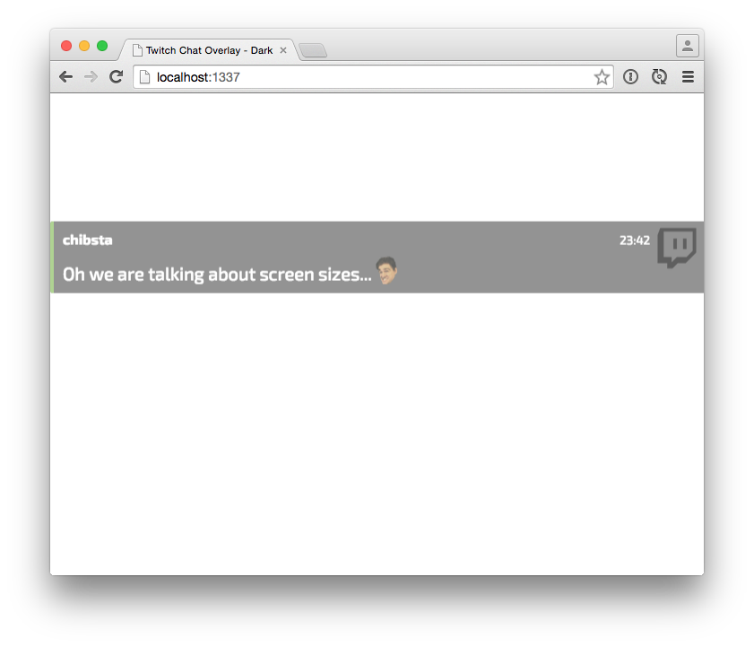

# twitch-chat-overlay

A Twitch chat overlay for your stream.

## Requirements

- OBS
- [CLR plugin for OBS](https://obsproject.com/forum/resources/clr-browser-source-plugin.22/)
- node.js
- coffeescript

## Starting guide

After downloading and unzipping, fire up your terminal and go to the unzipped folder.

	$ npm install
	$ coffee app.coffee

Then open up `http://localhost:1337/?username=[Your Username Here]` in your browser, and if all is well you should be presented with a white page. Send a message in chat (of the username you entered in the URL) and it should appear on the white page.

## Adding to OBS

Once you've got the CLR plugin installed, you can add it to your scene. In a popup it should ask for a few settings. Set the URL to the same one as you did above in your browser. For the size you can change it to whatever you wish the size to be.

**Make sure you start the app (`coffee app.coffee`) before enabling the browser on your scene. If it doesn't show up try to re-enable the browser on your scene.**

## Useless Preview

